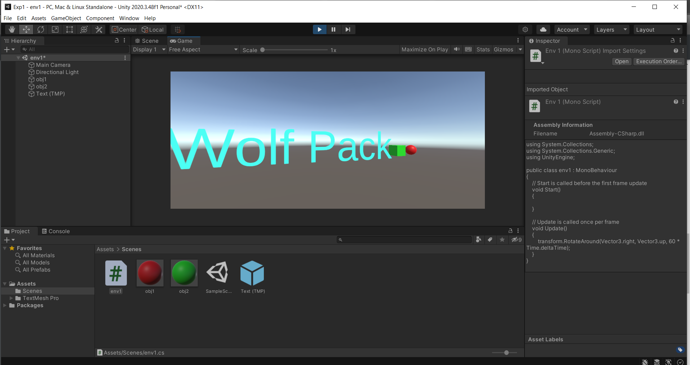
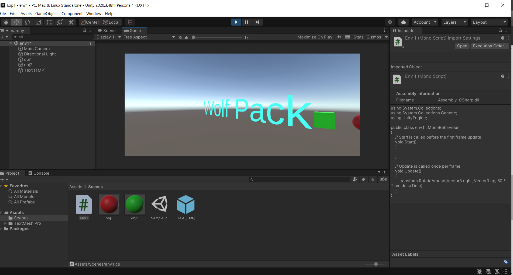

# Rotating-the-Gaming-Object

## Aim:
To develop a 3D application for rotating the gaming objects in unity.
## Algorithm:
### Step1:
Start 
### Step2:
Click File -> Scene -> Select the scene -> Save as-> New folder(Scenes)-> File name (Exp1)
### Step3:
1.Click Hierarchy -> 3DObject -> Cube

2.Hierarchy -> 3DObject -> Sphere

3.Hierarchy -> 3DObject -> Text

4.Hierarchy -> Effects -> Particle system
### Step4:
Create a folder in project and name as Materials
Material folder -> Create -> Material (Name: Cube)
Inspector ->Surface Inputs ->BaseMAp (Choose the color)
Drag the Cube to the plane and release the mouse

Create a folder in project and name as Materials
Material folder -> Create -> Material (Name: Sphere)
Inspector ->Surface Inputs ->BaseMAp (Choose the color)
Drag the Sphere to the plane and release the mouse

### Step5:
Click Hierarchy -> DirectionalLight
Inspector -> Change the color to red for Cube and blue for sphere.

### Step6:
Create a folder name exp1 and create a C# file to add the coding in it.

### Step7:
To add our C# Script file to our selected object, click on the C# Script file and drag it to our selected objects in the Hierarchy window and run the application.

### Step8:
Stop after the rotation.

## Program:
```
Developed by: MS.JEEVA
Reg no: 212221230040
```
```c#
using System.Collections;
using System.Collections.Generic;
using UnityEngine;

public class exp1 : MonoBehaviour
{
    // Start is called before the first frame update
    void Start()
    {
        
    }

    // Update is called once per frame
    void Update()
    {
        transform.RotateAround(Vector3.right, Vector3.up, 60 * Time.deltaTime);
        
    }
}
```
## Output:



## Result:
Thus a 3D application for rotating the gaming objects in unity is developed successfully.
